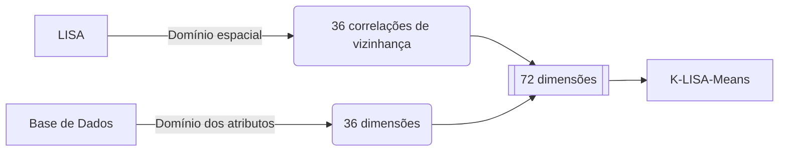

```mermaid
graph LR
    A[Pré-Processamentos] --> |Base de dados| B(Clusterização)
    B --> |5 taxonomias| C(Análises empíricas)
```

```mermaid
graph LR
    A[Base de Dados] --> |Domínio dos atributos| B(36 dimensões)
    C[LISA] --> |Domínio espacial| D(36 correlações de vizinhança)
    D --> E[[72 dimensões]]
    B --> E
    E --> F[K-LISA-Means]
```